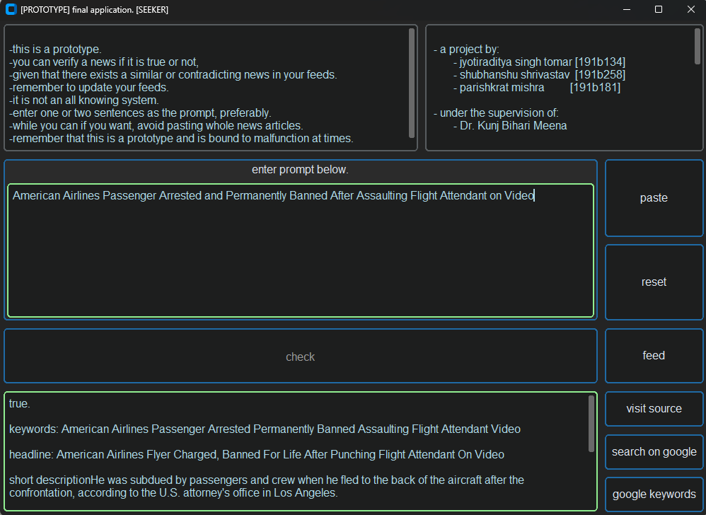

# Seeker

This Python application detects fake news through semantic comparison of user-input headlines with related news from trusted sources stored in a database populated by web feeds. The semantic comparison is powered by OpenAI's GPT 3.5 model. NLTK is used for identifying keywords from user-input headline. These keywords are then used to search for related news headline in a SQLite database with full text search capabilities provided by FTS-5 extension. A verdict is given after semantic comparison.

FTS enabled SQLite Database used for testing: https://drive.google.com/file/d/13rwTUSV5fbHNZgNYSfwz-Q1pzAXT7knS/view?usp=sharing

Dataset used: https://www.kaggle.com/datasets/rmisra/news-category-dataset
1. Misra, Rishabh. "News Category Dataset." arXiv preprint arXiv:2209.11429 (2022).
2. Misra, Rishabh and Jigyasa Grover. "Sculpting Data for ML: The first act of Machine Learning." ISBN 9798585463570 (2021).

## Overview

  
## Screenshot

